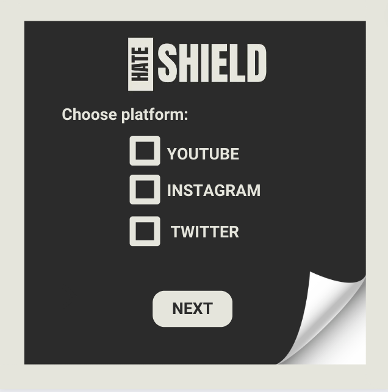
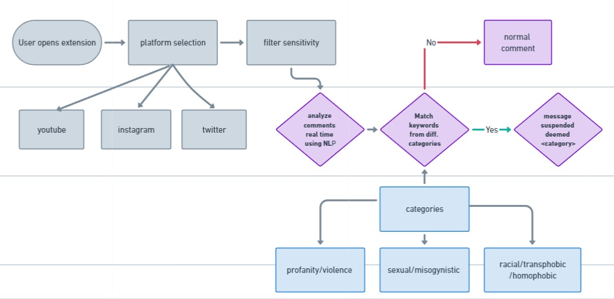

# hatesheild
# HateShield: A Chrome Extension for Blocking Hate Speech

<p align="center">
  
</p>

HateShield is a Chrome extension that utilizes advanced Natural Language Processing (NLP) techniques to shield users from hate speech on social media platforms. By classifying comments as hate speech or normal, it creates a safer online environment by filtering out racist, sexist, homophobic comments, and general profanity according to user preferences.

## Features

- **Customizable Filtering:** Users can select on which platforms they want to filter comments.
- **NLP Classification:** Leveraging state-of-the-art NLP models to accurately identify hate speech.
- **User-Friendly Interface:** Simple and intuitive interface for a seamless user experience.
- **Accuracy:** More accurate and consistent than competitors in the market.

## How it works

<p align="center">
  
</p>

1. **Platform Selection:** Users can choose the social media platforms where they want to apply the comment blocking functionality, such as YouTube, Instagram, or Twitter.
2. **Filtering Sensitivity:** Users can select the intensity level of the hate comment filtering, ranging from low to high sensitivity, to match their desired level of protection.
3. **NLP Analysis:** The extension utilizes advanced Natural Language Processing (NLP) techniques to analyze comments displayed on the screen in real-time.
4. **Keyword Matching:** Comments are compared against a pre-defined dataset containing keywords related to various offensive categories.
5. **Overwriting Comments:** If a comment matches any of the predefined categories, it is overwritten with a standardized message, such as "This comment was suspended because deemed <category>."
6. **Customization:** Users have the flexibility to add or remove keywords from the blocked list, allowing them to fine-tune the filtering criteria according to their preferences.

## UI Design
<p align="center">
  
  
</p>

## Installation

1. Clone the repository to your local machine.
   ```sh
   git clone https://github.com/yourusername/hateshield.git
